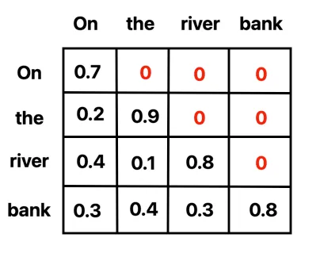
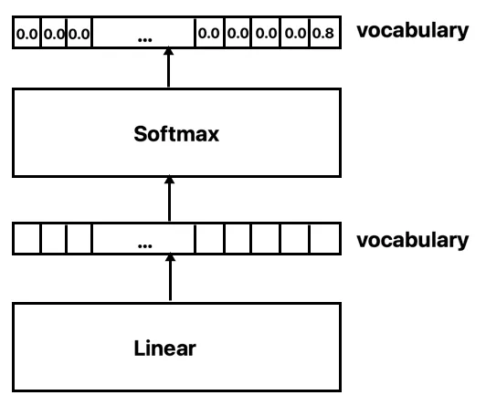

---
### Tokenization

Tokens are the basic building blocks that a transformer model processes. In the context of transformers, tokens can be words, sub-words, or even characters, depending on the specific tokenization strategy used. As we learnt earlier.
### Embeddings

Embeddings transform words or sentences into numerical representations, capturing their contextual meaning in a high-dimensional space. These representations are learned through machine learning, enabling algorithms to understand and process relationships between words or sentences more effectively.
#### Word Embeddings

Word embeddings are numerical representations of words that capture their semantic relationships based on context. These embeddings map words into high-dimensional vector spaces, allowing algorithms to understand and process word meanings.
##### Code snippet:
```python
# !pip install spacy
import spacy
nlp = spacy.load("en_core_web_sm")

word_embedding = nlp("LLM_Karyashala").vector
print(word_embedding)
```
#### Sentence Embeddings

Sentence embeddings represent entire sentences as vectors, summarizing their content in a numerical format. They are created by aggregating or encoding word embeddings to capture the overall meaning of a sentence.
##### Code snippet:
```python
# !pip install sentence-transformers
from sentence_transformers import SentenceTransformer
model = SentenceTransformer('paraphrase-MiniLM-L6-v2')

sample_sentence = "LLM Karyashala: Your Gateway to dive into LLM's."
sentence_embedding = model.encode([sample_sentence])
print(sentence_embedding)
```
#### Multilingual Sentence Embeddings

Multilingual sentence embeddings extend the concept of sentence embeddings to support multiple languages. These embeddings can capture the semantic similarities across sentences in different languages.
##### Code snippet:
```python
# !pip install sentence-transformers
from sentence_transformers import SentenceTransformer
model = SentenceTransformer('paraphrase-MiniLM-L6-v2')

sample_sentence = "LLM Karyashala: Your Gateway to dive into LLM's."
sentence_embedding = model.encode([sample_sentence])
print(sentence_embedding)
```
### Similarity Between Sentences

For LLM's, it is crucial to know when two words, or two sentences, are similar or different. This can be a hard problem, but luckily, word and sentence embeddings are very helpful for this task. Two common similarity metrics, frequently employed in the context of embeddings, are **Dot Product Similarity** and **Cosine Similarity**.
#### Dot Product Similarity

Dot product similarity quantifies the similarity between two vectors by multiplying their corresponding elements and summing the results. In the realm of word or sentence embeddings, the dot product provides a measure of directional similarity.
##### Code snippet:
```python
# !pip install sentence-transformers
from sentence_transformers import SentenceTransformer
import numpy as np
model = SentenceTransformer('paraphrase-MiniLM-L6-v2')

sample_sentence1 = "LLM Karyashala: Your Gateway to dive into LLM's."
sample_sentence2 = "LLM are large language models."
sentence1_embedding, sentence2_embedding = model.encode([sample_sentence1 , sample_sentence2])
dot_product_similarity = np.dot(sentence1_embedding, sentence2_embedding)
print("Dot Product Similarity:", dot_product_similarity)
```
#### Cosine Similarity

Cosine similarity computes the cosine of the angle between two vectors, offering a normalized similarity measure. In the context of word or sentence embeddings, cosine similarity ranges from -1 (indicating complete dissimilarity) to 1 (suggesting identical content).
##### Code Snippet:
```python
# !pip install sentence-transformers
from sentence_transformers import SentenceTransformer
from sklearn.metrics.pairwise import cosine_similarity
import numpy as np

model = SentenceTransformer('paraphrase-MiniLM-L6-v2')
sample_sentence1 = "LLM Karyashala: Your Gateway to dive into LLM's."
sample_sentence2 = "What are you doing?"
sentence1_embedding, sentence2_embedding = model.encode([sample_sentence1, sample_sentence2])
cosine_similarity_score = cosine_similarity([sentence1_embedding], [sentence2_embedding])[0][0]
print("Cosine Similarity:", cosine_similarity_score)
```
---
### What are Transformers?


A transformer is a neural network that collects and processes sequential data (like the words in a sentence) as it comes in and transforms one sequence into another sequence. Since their introduction, transformers have revolutionized the world of natural language processing.
Suppose we have the following sentences:

1. "On the river bank"
2. "On the bank of the river"

Now, traditional models might get confused about the word "bank" in the second sentence. But transformers? They're like magical readers! Instead of reading word by word, they look at the whole sentence at once. So, in our example, a transformer easily figures out that "bank" here means a cool spot by the river, not a place to save money. Transformers are the superheroes of understanding context!

### A High-Level Look


### Transformer Architecture - Encoder-Decoder

The architecture described in the paper [Attention Is All You Need](https://arxiv.org/abs/1706.03762) consists of an **encoder** and **decoder**. This architecture enables the model to capture intricate relationships between words.


### Input Embeddings

Transformers don't take raw text as input. Word embeddings are generated for the input sequence, enabling the model to comprehend the contextual meaning of words.


### Positional Encoding

While embeddings represent word meaning, they lack information about the relative position of tokens in a sentence. Positional encoding fills this gap, capturing the sequence's word positions.
As the name implies, positional encoding encodes the position of the words in the sequence.


Positional encoding works because absolute position is less important than relative position. For instance, we don’t need to know that the word “good” is at index 6 and the word “looks” is at index 5. It’s sufficient to remember that the word “good” tends to follows the word “looks”.

Here’s a plot generated using a sequence length of 100 and embedding space of 512 dimensions:


For the first dimension, if the value is 1, it’s an odd word, if the value is 0, it’s an even word. For the d/2th dimension, if the value is 1, we know the word is in the second half of the sentence and if the value is 0, then it’s in the first half of the sentence. The model can use this information to determine the relative position of the tokens.

### Encoder Input

After adding positional encoding, tokens become closer based on both semantic meaning and sentence position.


### Encoder

The Encoder maps all input sequences into an abstract continuous representation, holding learned information about word relationships. (i.e. how words relate to one another).
### Scaled Dot-Product Attention

This attention mechanism calculates attention scores for each word in a sequence, determining how much attention should be given to others.


After feeding the query, key, and value vectors through a linear layer, we calculate the dot product of the query and key vectors. The values in the resulting matrix determine how much attention should be given to the other words in the sequence given the current word. In other words, each word (row) will have an attention score for every other word (column) in the sequence.


The dot product is scaled by a factor of square root of the depth. This is done because for large values of depth, the dot product grows large in magnitude pushing the softmax function where it has small gradients which make it difficult to learn.


Once the values have been scaled, we apply a SoftMax function to obtain values between 0 and 1.


Finally, we multiply the resulting matrix by the value vector.


### Multi-Headed Attention

Multiple attention heads allow the model to consider different aspects simultaneously, enhancing its understanding of complex relationships.

For example, given the word “the”, the first head will give more attention to the word “bank” whereas the second head will give more attention to the word “river”.


It’s important to note that after the split each head has a reduced dimensionality. Thus, the total computation cost is the same as a single head attention with full dimensionality.

The attention output for each head is concatenated and put through a Dense layer.


### The Residual Connections, Layer Normalization, and Feed Forward Network

Residual connections, layer normalization, and a feed-forward network enhance the model's ability to avoid the vanishing gradient problem.

The original positional input embedding is added to the multi-headed attention output vector. This is known as a residual connection. Each hidden layer has a residual connection around it followed by a layer normalization. Residual connections help in avoiding the vanishing gradient problem in deep networks.


The output finishes by passing through a point wise feed forward network.
### Decoder

The decoder’s job is to generate text. The decoder has similar hidden layers to the encoder. However, unlike the encoder, the decoder’s output is sent to a SoftMax layer in order to compute the probability of the next word in the sequence.
### Decoder Input Embeddings & Positional Encoding

Autoregressive decoding predicts future values based on previous ones. Positional encodings are added to word embeddings to capture token positions.


### Masking

A look-ahead mask ensures accurate predictions during decoding, allowing only previous tokens to be used for predicting the next. 

For example, when predicting the third token in the sentence, only the previous tokens, that is, the first and second tokens, should be used.


### Output

The final SoftMax layer computes the probability of the next word in the sequence. The word with the highest probability becomes the next predicted word.



We take the word with the highest probability and append it to the sequence used in the next training iteration. 

Transformers, with their innovative architecture, are not just models; they're the magical readers of sequential data, making them the superheroes of understanding context.

### Learning from transformers

**Tokenizer**: Turns words into tokens.
**Embedding**: Turns tokens into numbers (vectors)
**Positional** encoding: Adds order to the words in the text.
**Transformer block**: Guesses the next word. It is formed by an attention block and a feedforward block.
**Attention**: Adds context to the text.
**Feedforward**: Is a block in the transformer neural network, which guesses the next word.
**SoftMax**: Turns the scores into probabilities in order to sample the next word
### What's Next?
[Workshop Booklet - Part 3 - LLM](Workshop%20Booklet%20-%20Part%203%20-%20LLM.md)