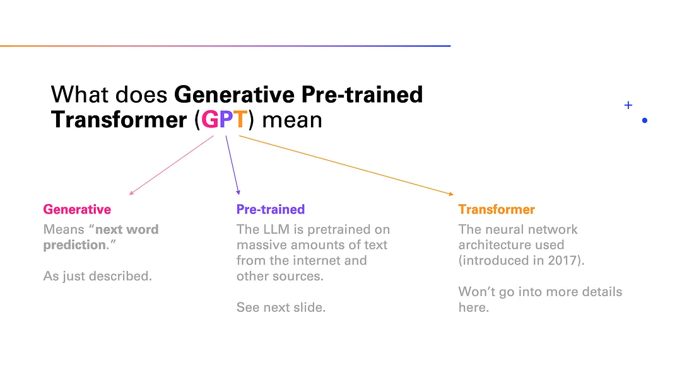

---

### What is LLM?

**LLM** is short for **Large Language Model**, which is a recent innovation in AI and machine learning.
LLMs are  advanced form of language model designed using deep learning methods and trained on massive volumes of textual data. These models possess the capability to generate text that closely resembles human language and excel in performing diverse natural language processing tasks.

### How LLMs Work?

1. **Learning from Text:** LLMs start by reading a massive amount of internet text, like learning from a vast library.

2. **Innovative Architecture:** They use a unique structure called a transformer, helping them understand and remember a lot of information efficiently.

3. **Breaking Down Words:** LLMs break sentences into smaller parts, even breaking words into pieces, for more effective language processing.
   
4. **Understanding Sentences:** Unlike simple programs, LLMs understand individual words and their relationships within a sentence, grasping the full linguistic context.

5. **Getting Specialized:** After general learning, LLMs can undergo specific training on topics, enhancing their abilities in tasks like answering questions or writing about specific subjects.

6. **Doing Tasks:** When given a prompt (question or instruction), LLMs use their knowledge to respond, functioning like an intelligent assistant capable of understanding and generating text.

#### Zero-shot Learning:

GPT-3's innovation lies in zero-shot learning, enabling it to perform tasks without explicit training. This contrasts with traditional models requiring specific training for each task. LLMs, including ChatGPT, seamlessly handle tasks like translation and sentiment analysis without task-specific training, showcasing their versatile capabilities.

### General Architecture of LLMs

1. **Embedding Layer:**
   - Function: Converts words in the input text into high-dimensional vectors.
   - Purpose: Captures word meanings, aiding the model in understanding the context.

2. **Feedforward Layers:**
   - Function: Layers that transform input vectors nonlinearly.
   - Purpose: Helps the model learn abstract features from the text.

3. **Recurrent Layers:**
   - Function: Understands information sequentially, maintaining a hidden state.
   - Purpose: Captures connections between words in a sentence.

4. **Attention Mechanism:**
   - Function: Allows focus on specific parts of the input text.
   - Purpose: Helps the model prioritize relevant portions, improving prediction accuracy.

These elements work together, allowing Large Language Models to effectively understand and generate text for various natural language processing tasks.

### Small Language Models(SLMs)

A SLM is generally refers to a language model with a lot fewer parameters, simpler architecture, or limited training data compared to LLMs. Small language models are faster to train and use less computational resources. SLMs typically have less capability to understand and generate complex language.

### Types of LLMs:

**1. Auto-regressive Language Models:**

   - Concept: An auto-regressive language model predicts the next word in a sentence based on preceding words. It mimics a smart storyteller, anticipating the next word to create coherent sentences.
   
   - Example: Given the sentence "The sun is shining ___ ," the model analyzes the context "The sun is shining" and predicts a suitable next word like "brightly."
   
   - Prominent Model:  GPT (Generative Pre-trained Transformer)

**2. Auto-encoding Language Models:**

   - Concept: Auto-encoding language models act like painters recreating images. They compress input into a simplified form and reconstruct the original input from this simplified version, capturing essential features.
   
   - Example: For an image of a cat, the model compresses it into numerical features representing the cat's essential details. It then reconstructs the original picture using only these features.

   - Model Example: Encoder-Decoder architecture serves as an illustration of auto-encoding language models.

These LLM types showcase diverse approaches in language processing, with auto-regressive models focusing on predictive coherence and auto-encoding models emphasizing feature compression and reconstruction.

### Open Source LLMs

Open source LLMs are advanced language models accessible to the public, created by combining learning parameters, extensive datasets, and specific training techniques.

**Components:**
1. **Learning Parameters:**
   - Model Architecture: Utilizes GPT or similar architectures with transformer neural networks.
   - Hyperparameters: Settings influencing model capacity and performance.
   - Training Duration: Involves weeks to months of computational training.

2. **Large Data:**
   - Text Corpora: Trained on vast internet text corpora for versatility.
   - Preprocessing: Tokenization and data formatting for training sequences.
   - Data Augmentation: Techniques enhancing robustness.

3. **Models:**
   - Pre-trained: Initial phase predicts the next word, providing comprehensive language understanding.
   - Fine-tuning: Tailors the model for specific tasks using curated datasets.

**Examples:**
1. **StableLM**
2. **Orca-3b**
3. **GPT4All**

### Prompt Engineering

Prompt engineering is like giving clear instructions to a language model, guiding it to generate the responses you want. It's about crafting questions or prompts in a way that helps the model produce the desired output.

#### Types of Prompting

##### Zero-Shot Prompting:

A task or question is presented to the model without any prior training on that specific task. The model is anticipated to generate a response even for unfamiliar tasks.

**Prompt:**
Evaluate the sentiment:  
Text: "The movie exceeded my expectations, truly exceptional!"

---
##### One-Shot Prompting:

A single example or prompt for a specific task is provided to the model, guiding it to understand and perform that task.

**Prompt:**
Evaluate the sentiment:
Text: 'This basketball is easy to carry'. 
    - Classification: Pos 
Text: This basketball has a lot of weight' 

---
##### Few-Shot Prompting:

A few examples or prompts related to a task are presented to the model, helping it generalize and perform that task with broader context.

**Prompt:**
Evaluate the sentiment:
Text: "The movie exceeded my expectations, truly exceptional!"
    - Classification: Pos
Text: "The plot was confusing and disappointing."
    - Classification: Neg
Text: "The film left me indifferent, neither good nor bad."
    - Classification: Neu
Text: "I don't like your attitude"

### Fine Tuning LLMs

Fine-tuning is taking a pre-trained model and training at least one internal model parameter (i.e. weights). The key upside of this approach is that models can achieve better performance while requiring (far) fewer manually labeled examples compared to models that solely rely on supervised training.

### Langchain

Langchain is a framework designed for building applications driven by language models. It empowers applications that:

1. **Are Context-Aware:** Connect a language model to sources of context, such as prompt instructions, few-shot examples, and relevant content.

2. **Reason:** Depend on a language model to reason, determining how to answer based on provided context and deciding on appropriate actions.

In essence, LangChain facilitates the development of applications that understand context and leverage language models for reasoning tasks.

#### Langchain Modules

- Model I/O
    - Chat Models
    - PromptTemplate
    - Output Parsers
- Chains
- Memory
- Retrieval
- Agents